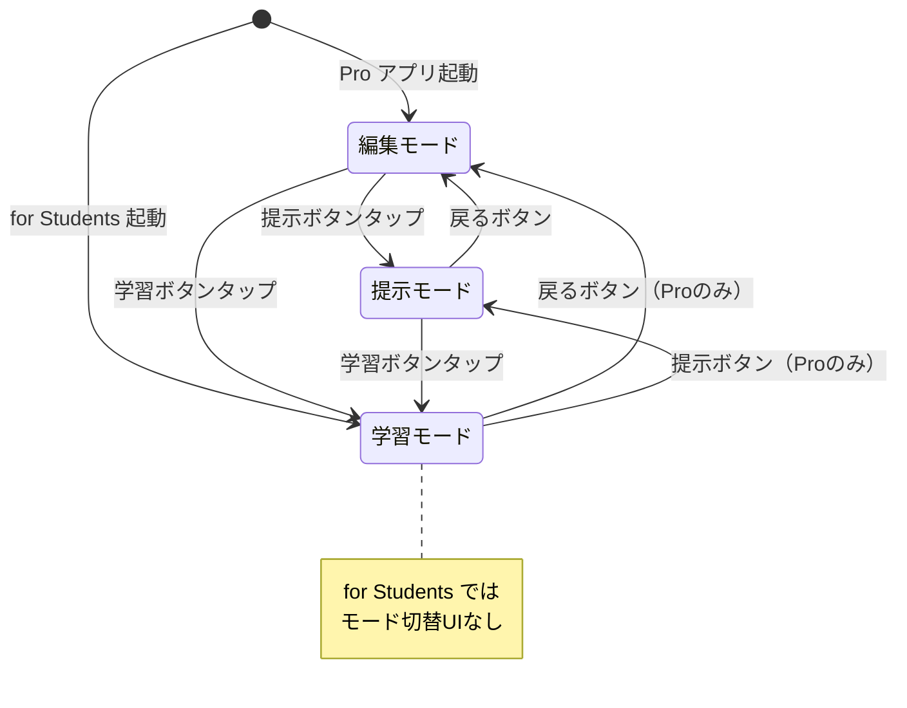
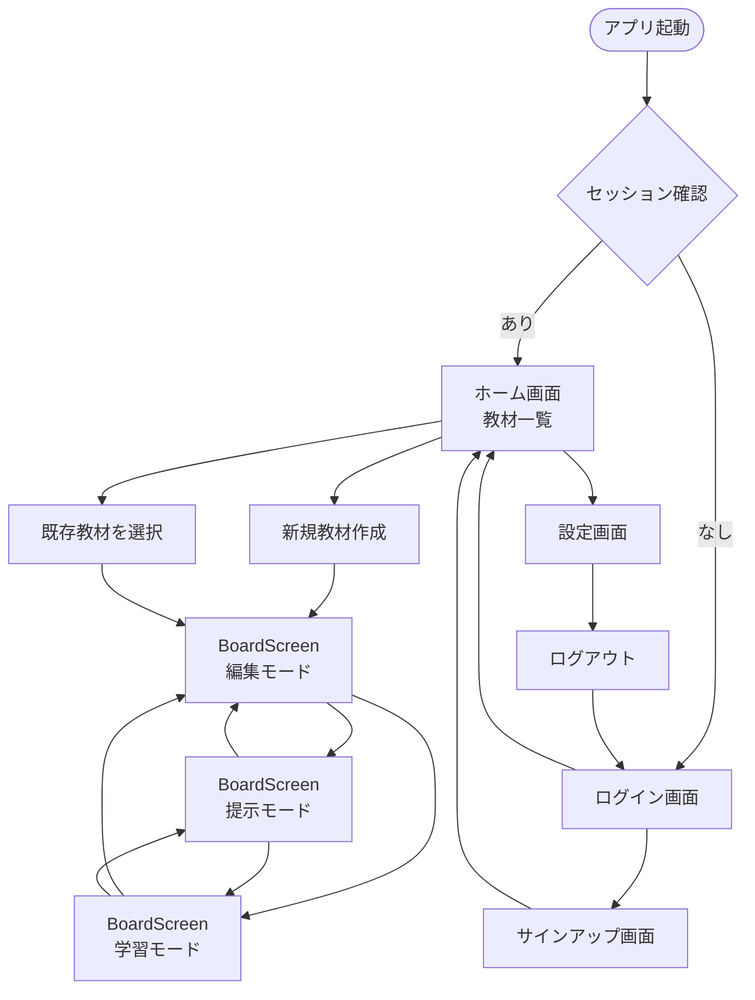
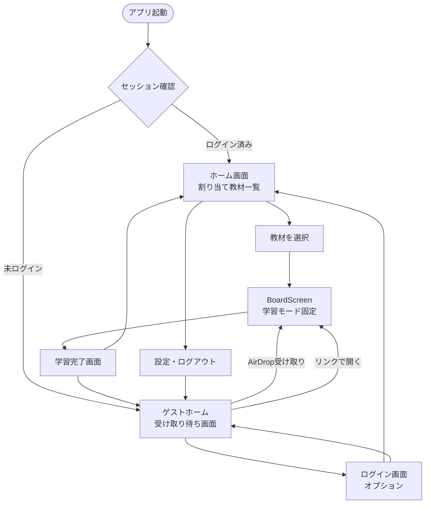
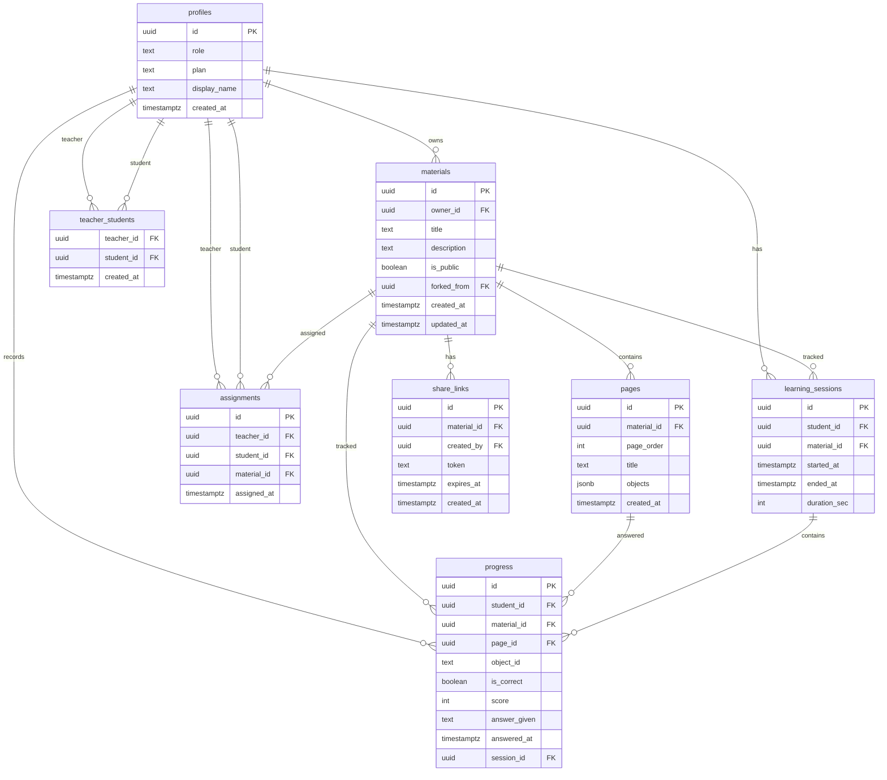

# Finger Board — 設計ドキュメント

**作成日:** 2026-02-28  
**ステータス:** 確定（随時更新）  
**前提となる仕様書:** `finger_board_migration_spec.md`

---

## 0. 設計の大原則（今日の決定事項）

| 決定項目 | 内容 | 理由 |
|---|---|---|
| アプリ分離戦略 | Pro / for Students を**別々にビルド・配布** | ロール混在によるカオスを防ぐ |
| ゲストモード入口 | for Students は**デフォルトがゲスト**、ログインはオプション | 教材を受け取ったらすぐ使える |
| Phase 1 完成条件 | **TestFlight で実機確認**できる状態 | 動くものを手で触って確かめる |
| モード設計 | 編集・提示・学習の3モードを**同一 BoardScreen 内で切り替え** | 旧アプリの振る舞いを踏襲 |
| 学習モードの共通化 | Pro の学習モード = for Students の全機能 | コードの重複を防ぐ |

---

## 1. リポジトリ・フォルダ構造

### 1-1. モノレポ構成（2アプリ共存）

```
finger_board/                      ← モノレポルート
├─ lib/
│   ├─ features/                   ← 機能単位（両アプリで共有）
│   │   ├─ auth/                   ✅ 実装済み
│   │   ├─ board/                  ✅ 実装済み（モード追加が必要）
│   │   ├─ materials/              ✅ 実装済み
│   │   ├─ marketplace/            ⬜ Phase 2
│   │   ├─ progress/               ⬜ Phase 2
│   │   └─ viewer/                 ⬜ Phase 2
│   │
│   ├─ shared/                     ← 両アプリで使う共通部品
│   │   ├─ models/
│   │   │   ├─ page_data.dart
│   │   │   └─ board_object.dart
│   │   ├─ widgets/
│   │   └─ services/
│   │       └─ mun_import_service.dart
│   │
│   ├─ core/                       ← アプリ共通基盤
│   │   ├─ router/
│   │   ├─ theme/
│   │   └─ supabase/
│   │
│   ├─ app_pro/                    ← Pro アプリのエントリポイント ⬜ 追加予定
│   │   ├─ main_pro.dart           ← flutter run -t lib/app_pro/main_pro.dart
│   │   └─ router/
│   │       └─ pro_router.dart     ← Pro 専用ルート（編集・提示・学習モード）
│   │
│   └─ app_students/               ← for Students のエントリポイント ⬜ 追加予定
│       ├─ main_students.dart      ← flutter run -t lib/app_students/main_students.dart
│       └─ router/
│           └─ students_router.dart ← Students 専用ルート（学習モードのみ）
│
├─ main.dart                       ← 現在の開発用エントリ（移行後は削除）
└─ design_docs/                    ← このフォルダ
    └─ finger_board_design.md
```

### 1-2. アプリ分離の考え方

```
features/board/         ← BoardScreen + 3モード（共通コア）
    ↑                        ↑
app_pro/router          app_students/router
  編集モードで起動          学習モード固定で起動
  提示モードに切替可        モード切替UIなし
  学習モードに切替可
```

**重要な原則:** `features/` の中には「どちらのアプリか」の知識を持たせない。  
アプリ固有の知識は `app_pro/` と `app_students/` だけが持つ。

---

## 2. BoardScreen モード設計

### 2-1. モード定義

```dart
enum BoardMode {
  edit,     // 編集モード：オブジェクト追加・移動・削除・保存
  present,  // 提示モード：先生が操作しながら生徒に見せる
  study,    // 学習モード：生徒が答える・進捗が記録される
}
```

### 2-2. モードによる機能差異

| 機能 | 編集モード | 提示モード | 学習モード |
|---|---|---|---|
| オブジェクト追加・削除 | ✅ | ❌ | ❌ |
| オブジェクト移動 | ✅ | ❌ | ❌ |
| 保存ボタン | ✅ | ❌ | ❌ |
| QuestionBox に答える | ❌ | ❌ | ✅ |
| QuestionBox の答えを見せる | ❌ | ✅ | ❌ |
| 進捗記録 | ❌ | ❌ | ✅ |
| ページ切り替え | ✅ | ✅ | ✅ |
| モード切替ボタン（AppBar） | ✅ | ✅ | ✅（Proのみ） |

### 2-3. モード状態遷移図



### 2-4. 実装方針

```dart
// board_provider.dart に BoardMode を追加
class BoardState {
  final List<BoardObject> objects;
  final int currentPage;
  final BoardMode mode;  // ← 追加
  ...
}

// BoardScreen は mode を見て UI を出し分ける
Widget build(BuildContext context) {
  final mode = ref.watch(boardProvider(materialId)).mode;
  return Scaffold(
    appBar: _buildAppBar(mode),      // モードで AppBar が変わる
    body: BoardCanvas(mode: mode),   // モードで Canvas の挙動が変わる
  );
}
```

---

## 3. 画面遷移図

### 3-1. Finger Board Pro



### 3-2. Finger Board for Students



---

## 4. データモデル（ER図）

### 4-1. 全テーブル関係図



### 4-2. テーブル実装状況

| テーブル | 状態 | Phase |
|---|---|---|
| `profiles` | ✅ 作成済み | 1 |
| `materials` | ✅ 作成済み | 1 |
| `pages` | ✅ 作成済み | 1 |
| `teacher_students` | ⬜ 未作成 | 2 |
| `assignments` | ⬜ 未作成 | 2 |
| `progress` | ⬜ 未作成 | 2 |
| `learning_sessions` | ⬜ 未作成 | 2 |
| `share_links` | ⬜ 未作成 | 2 |

---

## 5. RLS 仕様（アクセス制御の仕様書）

RLS は「セキュリティ設定」ではなく**「誰が何にアクセスできるかの仕様書」**として扱う。

| テーブル | SELECT | INSERT | UPDATE | DELETE |
|---|---|---|---|---|
| `profiles` | 本人のみ | 本人のみ（サインアップ時） | 本人のみ | ❌ |
| `materials` | 本人 OR `is_public=true` | 本人のみ | 本人のみ | 本人のみ |
| `pages` | materials に準ずる | materials の owner のみ | materials の owner のみ | materials の owner のみ |
| `teacher_students` | 関係する teacher or student | teacher のみ | ❌ | teacher のみ |
| `assignments` | 関係する teacher or student | teacher のみ | ❌ | teacher のみ |
| `progress` | 本人 + 紐づいた teacher | 本人のみ | ❌ | ❌ |
| `learning_sessions` | 本人 + 紐づいた teacher | 本人のみ | 本人のみ（ended_at 更新） | ❌ |
| `share_links` | token 一致で誰でも | creator のみ | ❌ | creator のみ |

**注意:** `guest` ユーザーは Supabase Auth を使わないため、RLS の対象外。ゲストが扱うデータはローカル（デバイス内）のみ。

---

## 6. オフライン境界線

「Supabase が必要な処理」と「なくても動く処理」の境界を明確にする。

### Supabase なしで動く（ゲスト・オフラインでも OK）

- ローカルの `.mun` ファイルを読み込む
- ボードを表示する（学習モード含む）
- AirDrop / リンクで受け取った教材を開く

### Supabase が必要（ログイン必須）

- 教材をサーバーに保存・読み込み
- 教材を他ユーザーに共有（リンク生成）
- 進捗を記録・参照
- 教師が生徒を管理
- マーケットプレイスへの公開・閲覧

### 実装上の境界線

```dart
// services は Supabase 依存を明示する
class MaterialsService {
  // ✅ ローカルのみ → guest でも使える
  Future<PageData> loadFromFile(File file) async { ... }

  // 🔒 Supabase 必須 → ログイン確認が必要
  Future<void> saveToCloud(PageData page) async {
    if (supabase.auth.currentUser == null) throw UnauthenticatedException();
    ...
  }
}
```

---

## 7. Phase 1 完成チェックリスト（TestFlight まで）

### 機能要件

- [x] ログイン・サインアップ（Supabase Auth）
- [x] 教材一覧画面
- [x] 教材作成・DB保存
- [x] ボード編集（オブジェクト操作）
- [x] ページ保存（Supabase）
- [x] ファイルピッカー（.mun/.json）
- [ ] ページ読み込み（DB → ボード表示）
- [ ] 教材タイトル編集
- [ ] 複数ページ対応
- [ ] .mun インポート動作確認
- [ ] BoardMode 実装（編集・提示・学習の切り替え）
- [ ] AssembleBox SVG 表示（fbi_to_svg.py 完成後）

### TestFlight 配布要件

- [ ] Apple Developer Program 登録確認（年額 $99）
- [ ] Xcode セットアップ
- [ ] Bundle ID 設定（`com.semiosis.fingerboardpro`）
- [ ] Signing & Capabilities 設定
- [ ] iOS 実機でビルド確認
- [ ] TestFlight にアップロード
- [ ] Supabase Email 確認を有効化（リリース前に必須）

### app_pro / app_students 分離要件

- [ ] `lib/app_pro/main_pro.dart` 作成
- [ ] `lib/app_students/main_students.dart` 作成
- [ ] `main.dart` を開発用として整理
- [ ] 各アプリ専用 Router の作成

---

## 8. 今後の Phase 別設計メモ

### Phase 2（教育機能）で追加する設計

- QuestionBox の仕様（問題タイプ：選択・入力・並べ替え等）
- 学習セッションの開始・終了フロー
- 進捗データの記録タイミング
- ブラインドモード（答えを隠す）の仕様

### Phase 3（アクセシビリティ）で追加する設計

- BLE スイッチ接続仕様
- TTS（読み上げ）の対象オブジェクトと順序

### Phase 5（Dashboard）向けの先行仕込み

`progress` テーブルの `object_id` は**QuestionBox の ID と一致させる**こと。  
Phase 2 で QBox を実装するとき、このルールを徹底しないと Dashboard での集計が壊れる。

---

## 9. 用語集

| 用語 | 意味 |
|---|---|
| BoardScreen | ボードを表示・編集・操作するメイン画面 |
| BoardMode | 編集・提示・学習の3モード |
| BoardObject | ボード上に置かれたオブジェクト（LetterBox, ImgBox等） |
| AssembleBox | .fbi ファイルを SVG 変換して表示するオブジェクト |
| QuestionBox | 問題を表示・採点するオブジェクト（Phase 2） |
| .mun ファイル | 旧アプリの教材ファイル形式（AMF3 + zlib） |
| .fbi ファイル | .mun 内に含まれる Flash ベースのアセット |
| material | 教材（複数ページを含む） |
| page | 教材の1ページ（BoardObject のリストを JSONB で保持） |
| guest | Supabase Auth 未使用、ローカルのみ動作するユーザー |
